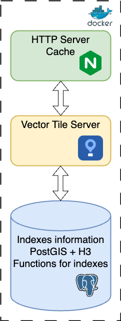

# City Indexes

## Process in a nutshell

### Prerequisites

To run commands you need [Just](https://github.com/casey/just).

Data preparation and final data to build tiles are stored in PostgreSQL. Two extentions should be installed [PostGIS](https://postgis.net/) and [H3/H#_PostGIS](https://pgxn.org/dist/h3).
[Docker image](https://hub.docker.com/r/isinus/postgis-h3/tags) with PostgreSQL 16 and all  required extensions. Or you can build you version  (see example 'just build-postgis-h3') of Docker Image using [Dockerfile.pgh3](./Dockerfile.pgh3).

Also you need 'psql' installed on host you processing data.

To process and upload OSM data to PostgreSQL install [osmium-tool](https://osmcode.org/osmium-tool/manual.html) and [osm2pgsql](https://osm2pgsql.org/).

Set environment variables in `.env` (required vars are in `.env.example`).

Local environment setup - run [docker-compose](local/docker-compose.yml).

Also create virtual environment with installed [requirements.txt](requirements.txt).

### PostgreSQL Init

Create a user - e.g. `city_admin`. You need to write it down together with password in `.env` files.

For data preparation table `city_districts` is required. Can be created with [city_districts_database.sql](sql_deploy/city_districts_database.sql). Performance setting can be adjusted using [PGTune](https://pgtune.leopard.in.ua/).

For site table `city_indexes` is required.  Can be created with [city_indexes_database.sql](sql_deploy/city_indexes_database.sql).

### Steps
There are following steps in data preparation:
1. Download OSM Data - get data for latest OSM;
2. Extract Cities - prepare cities boundaries for PBF processing;
3. Load PBF to PostgreSQL - split data by city and load into PostgreSQL;
4. Get cities information - prepare cities boundaries, centers in PostgreSQL and JSON for site;
5. Prepare Indexes - build city indexes.

#### Download OSM Data
All indexes are build using OpenStreetMap data - https://wiki.openstreetmap.org/wiki/Downloading_data.

OSM data is loaded in format of PBF from https://download.geofabrik.de (`just download-osm`).

List of countries to download are set in [countries](osm-data/countries) - the first value is region, the second - country (`<region> <country>`). Russia is being loaded explicitly as has different naming in GeoFabrik.

Downloaded files are saved in [osm-data](osm-data) as `<country>-latest.osm.pbf`.

#### Extract Cities
As we process PBF files only for specific cities (because of resources required to process all countries in bigger) it is required to split country PDF to cities PBF. It is done using `just extract-cities`.

By default cities list is taken from [cities](utils/cities) - file format is `<polygon_id> <city_name> <country>`. Polygon ID can be taken from result of search [overpass turbo](https://overpass-turbo.eu/?template=key-value&key=place&value=city). Polygon ID is required to get coordinates from https://polygons.openstreetmap.fr/get_poly.py.

City PBF is extracted using [osmium-tool](https://osmcode.org/osmium-tool/manual.html).

Result of process is saved in [osm-data](osm-data) as `<polygon_id>.pbf`.

#### Load PBF to PostgreSQL
Load to PostgreSQL is done per city (using extracted city PBFs) with the help of [osm2pgsql](https://osm2pgsql.org/doc/manual.html) (`just load-pbf`).

Configuration file is [city_districts.lua](osm-data/city_districts.lua).

Result of data load will be in database `city_districts` (configured in `.env` - variable `DATABASE_URL`).

#### Get cities information

As on step "Extract Cities" we need city boundaries but now in SQL and JSON file for site. We need such information to build indexes for separate cities one by one because of resources limitations.

To get list of cities run `just fill-cities`.

It will select required cities and prepare tables in PostgreSQL and update file [cities.json](local/static/script/cities.json). in the JSON file replace

#### Prepare Indexes

The main data processing mainly done with SQL with some geo spacial processing (operations with H3) are done in Python.

There are steps (same as `just` commands):
- **prepare-indexes** - build indexes based on simple distance (square of distance) to objects (public transport stops, schools and etc.) and counts (as number of routes of public transport e.g.) only in the area where residential are;
- **prepare-indexes-full** -  build indexes based on simple distance and counts for the whole cities;
- **prepare-indexes-isochrones** - build indexes based on isochrones for walking and car (for long distance) built using [Valhalla](https://github.com/valhalla/valhalla) routing engine.

While processing data outliers on city level are removed using [IQR](https://en.wikipedia.org/wiki/Interquartile_range).

Result of all operations above are 3 tables: `city_indexes`, `city_indexes_full` and `city_indexes_isochrones`. They will be used in site to delivery information to users.

### Deploy

Code of site with map and dialog for options selection is located in [static](local/static). You can directly user database and tables you have created on "Prepare Indexes" stage or copy data to separate database/instance.

Data location is set in [martin-config.yaml](local/martin-config.yaml) through `$DATABASE_URL`.

#### Architecture

|Overview||
|---|---|
| |  There are 3 levels:   - **nginx** to serve traffic and cache requests;  - **Martin** as a tile server to call appropriate [functions](https://maplibre.org/martin/sources-pg-functions.html) in PostgreSQL;  - **PostgreSQL** - database (`city_indexes`) to store indexes and build tiles based on user requests.|

You can use the same setup and database ([docker-compose.yml](local/docker-compose.yml)) to serve data to users or have separate stack with all components ([local server](local-server/docker-compose.yml)).

There are following steps to deploy (either to remote or local server) data for serving to users:
1. Copy Data - copy required tables to PostgreSQL (database should be created and configured);
2. Invalidate Cache - if indexes calculation logic has changed you need to clear nginx cache;
3. Copy Static Files - copy new/changed site files;
4. Warmup cache - in case you want to have some data already in nginx cache.

#### Copy Data
Copy table data through binary format - `just deploy-city-indexes`.

Tables `city_indexes`, `city_indexes_full` and `city_indexes_isochrones` will be copied to destination database `$DATABASE_URL_{{ location }}`.

#### Invalidate Cache

Run from your catalog with docker-compose file `sudo rm -R cache/`.

#### Copy Static Files

All static content for site can be copied by `just deploy-site`.

While copying change host name to appropriate domain.

#### Warmup Cache

Cache warmup is done using sequential (not to overload site) requests using [Python code](utils/cache_warmup.py) - `just cache-warmup`. It will make request with predefined parameters combinations (`PARAMETERS`) and for specific [list of cities](utils/cities_list_cache) (the biggest and most useful).
